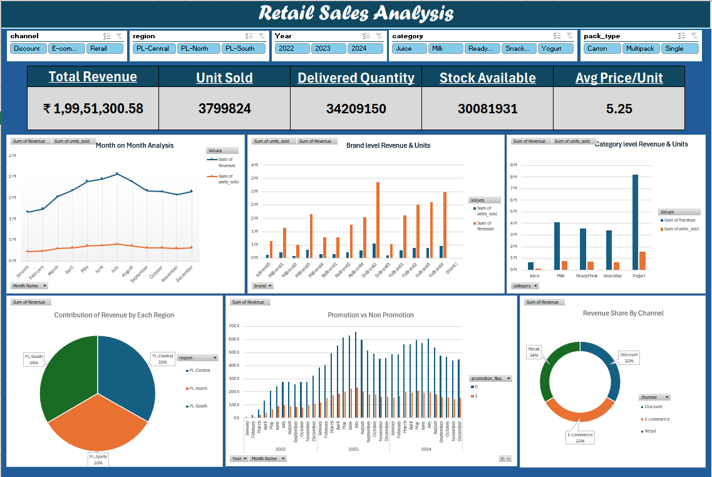

# Retail Sales Analysis Dashboard (Excel)

An interactive Excel-based sales analysis dashboard tracking **₹1.99 Cr+** in revenue, units sold, and stock metrics across multiple sales channels and product lines.



## Business Problem
Retail businesses face challenges monitoring MoM sales trends, regional distribution, brand performance, and evaluating the ROI of marketing promotions across retail, discount, and e-commerce channels.

## Key Metrics (KPIs)
* **Total Revenue:** ₹1,99,51,300.58
* **Total Units Sold:** 3,799,824
* **Delivered Quantity:** 3,420,915
* **Available Stock:** 30,081,931 units
* **Average Price / Unit:** ₹5.25

## Key Features & Visuals
* **Dynamic Multi-Slicers:** Interactive filtering by Channel (*Discount, E-commerce, Retail*), Region (*PL-Central, North, South*), Year (*2022–2024*), Category (*Juice, Milk, ReadyMeal, SnackBar, Yogurt*), and Pack Type.
* **Month-on-Month Trend Analysis:** Time-series line chart tracking monthly revenue and unit volume spikes (peaking around July).
* **Category & Brand Breakdown:** Highlighting top-performing product categories (e.g., Yogurt and Milk driving volume).
* **Promotion vs. Non-Promotion Impact:** Comparative analysis evaluating the true lift driven by promotional campaigns.
* **Regional & Channel Share:** Visualized market distribution across North, South, and Central regions, alongside channel proportions.

## Tools & Techniques
* **Microsoft Excel:** Pivot Tables, Pivot Charts, Slicers & Timeline filters, Data Modeling, Dashboard Design.

## How to Use
1. Download or clone this repository:
   ```bash
   git clone [https://github.com/](https://github.com/)<your-username>/retail-sales-analysis-excel.git
